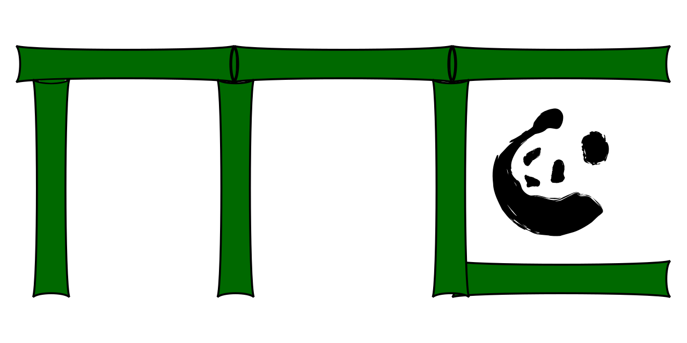

BambooMC - A Geant4-based Monte Carlo simulation Program
========================================================



BambooMC is a Geant4-based Monte Carlo simulation program. It is mainly used in the PandaX projects <https://pandax.sjtu.edu.cn> for the simulation of backgrounds. It can be easily extended for other purpose.

## Design Philosophy

The BambooMC is designed to be a modularized program. Such a feature enables users to combine different detector, physics processes and data managers without modify the existing sources. That would be very effective for the optimization of particle detectors.

Users need to provide a config file in given format, which defines key parameters for the simulation. Examples can be found in the `config` directory.

A typical usage of the program is

```bash
${path_to_bamboomc}/BambooMC -c config_file [ -m macro_file ] [ -n nevents ] [ -o output_file ] [ -i ]
```

The `config_file` gives the definition of the detectors, event generator, physics and analysis used for the simulation. It is necessary for a simulation. Other paramters are optional. The macro file uses the default G4macro format and can used to define some parameters in the simulation. The `-n` parameter defines how many events (nevents) will be simulated. The `-o` parameter defines the name of the output file. The `-i` option will make the program runs in interactive mode. Following gives a summary of these parameter.

+    `-c`: gives the config file,
+    `-f`: gives the macro file, same as "-m"
+    `-m`: gives the macro file, same as "-f"
+    `-n`: gives the number of events to be simulated
+    `-o`: gives the output parameter
+    `-i`: program runs in interactvie mode 
+    `-g`: generate a GDML file.

### Build the program

We recommend to build the program in GNU/Linux. Building it in other OS has not been tested and verified.

#### Prerequisite

A C++ compiler supporting the C++14 standard is required (GCC 6, GCC).

CMake version 3.12 and above, Geant4 version 10.02 and above, built with Qt support, ROOT 6 are required.

One need to setup the environment variables of above software.

#### Build the program

The simplest way to build the program is given below

```bash
mkdir build
cd build
cmake -DCMAKE_BUILD_TYPE=Release -DENABLE_DETECTOR_SETS=example,optical_example -DENABLE_USER_MC=pandax ..
make
```

The option `ENABLE_DETECTOR_SETS` means to include the sources in the detector directory. Multiple sets of detectors are separated by comma.


